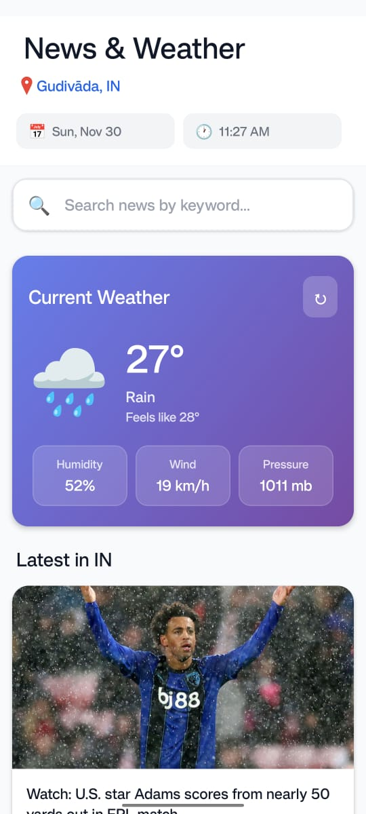
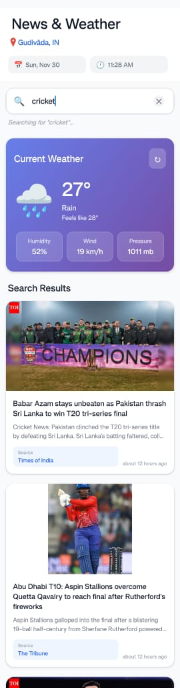
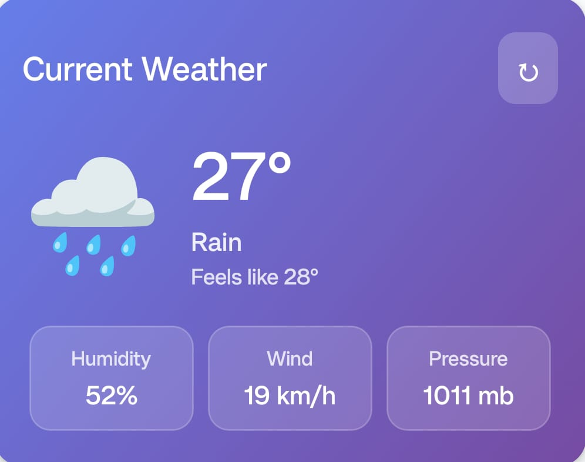
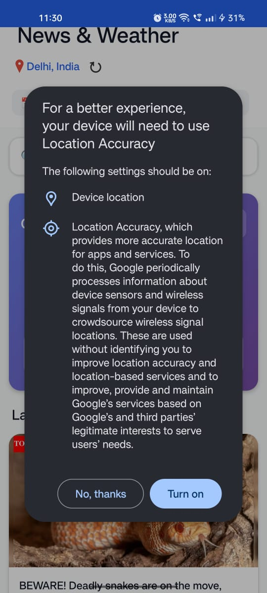

# 📰 News & Weather App

A modern React Native mobile application that provides real-time news updates and weather information based on user location. Built with TypeScript, Expo, and following industry best practices.

## 🌟 Features

### Core Functionality
- **📱 News Listing**: Browse recent news articles with thumbnails, titles, and descriptions
- **🔍 Real-time Search**: Filter news articles instantly as you type
- **📍 Location-Based News**: Get regional news based on your current location
- **☀️ Weather Information**: View current weather conditions with beautiful gradients
- **🔗 External Links**: Open full articles in browser with smooth transitions
- **🔄 Pull to Refresh**: Update news and weather data with a simple pull gesture

### User Experience
- Clean, modern UI with smooth animations
- Loading states and error handling
- Location permission management with informative modal
- Default fallback to Delhi, India if location access is denied
- Responsive design for all screen sizes
- Visual feedback for all user interactions

## 📸 Screenshots

### Home Screen

*Main screen showing news feed and weather card*

### Search Functionality

*Real-time search filtering news articles*

### Weather Display

*Current weather information with dynamic gradients*

### Location Permission

*Location permission request with feature explanations*

## 🛠️ Technical Stack

- **Framework**: React Native (Expo)
- **Language**: TypeScript
- **Location Services**: expo-location
- **HTTP Client**: Fetch API
- **UI Components**: Custom components with React Native core
- **Date Formatting**: date-fns
- **Gradients**: expo-linear-gradient

## 📋 Prerequisites

Before you begin, ensure you have the following installed:
- Node.js (v16 or higher)
- npm or yarn
- Expo CLI (`npm install -g expo-cli`)
- iOS Simulator (for Mac) or Android Studio (for Android development)
- Expo Go app on your physical device (optional)

## 🚀 Setup Instructions

### 1. Clone the Repository
```bash
git clone https://github.com/praveen5102/NewsWeatherApp.git
cd NewsWeatherApp
```

### 2. Install Dependencies
```bash
npm install
# or
yarn install
```

### 3. Configure API Keys

#### Get Your API Keys
1. **GNews API**:
   - Visit [https://gnews.io](https://gnews.io)
   - Sign up for a free account
   - Copy your API key from the dashboard

2. **OpenWeatherMap API**:
   - Visit [https://openweathermap.org/api](https://openweathermap.org/api)
   - Create a free account
   - Navigate to API keys section
   - Generate and copy your API key

#### Setup Environment Variables
1. Create a `.env` file in the root directory:
```bash
cp .env.example .env
```

2. Open `.env` and add your API keys:
```env
EXPO_PUBLIC_GNEWS_API_KEY=your_gnews_api_key_here
EXPO_PUBLIC_OPENWEATHER_API_KEY=your_openweather_api_key_here
```

⚠️ **Important**: Never commit the `.env` file to version control. It's already included in `.gitignore`.

### 4. Run the Application

#### For Development
```bash
# Start Expo development server
npm start
# or
expo start
```

#### For iOS (Mac only)
```bash
npm run ios
```

#### For Android
```bash
npm run android
```

#### Using Expo Go
1. Install Expo Go from App Store (iOS) or Play Store (Android)
2. Scan the QR code from the terminal
3. The app will load on your device

## 🏗️ Project Structure

```
news-weather-app/
├── App.tsx                      # Main application entry point
├── app.json                     # Expo configuration
├── package.json                 # Dependencies and scripts
├── tsconfig.json               # TypeScript configuration
├── .env.example                # Environment variables template
├── components/
│   ├── HeaderSection.tsx       # Date, time, and location display
│   ├── LocationPermissionCard.tsx  # Permission request modal
│   ├── NewsCard.tsx            # Individual news article card
│   ├── SearchBar.tsx           # Search input component
│   └── WeatherCard.tsx         # Weather information display
├── services/
│   └── api.ts                  # API integration and configuration
├── theme/
│   └── colors.ts               # Color palette and theme
├── types/
│   └── index.ts                # TypeScript interfaces
└── screenshots/                # App screenshots for README
```

## 🎨 Design Decisions

### Architecture
- **Component-Based Design**: Modular, reusable components for maintainability
- **TypeScript**: Full type safety to catch errors during development
- **Separation of Concerns**: API logic separated from UI components
- **Custom Hooks**: Efficient state management with React hooks

### UI/UX Choices
1. **Weather Gradients**: Dynamic background colors based on weather conditions
   - Clear sky: Blue gradient
   - Clouds: Gray gradient
   - Rain: Dark blue gradient
   - Creates visual connection between data and design

2. **Search Implementation**: Real-time filtering without API calls
   - Filters local data for instant results
   - Reduces API costs and improves performance
   - Clear button for quick reset

3. **Location Flow**: Progressive enhancement approach
   - Request permission with clear explanation
   - Graceful fallback to default location (Delhi, India)
   - Visual indicator when using default location

4. **Loading States**: Skeleton screens and spinners
   - Improves perceived performance
   - Reduces user anxiety during data fetching
   - Professional, polished experience

### Performance Optimizations
- **FlatList**: Virtualized scrolling for large news lists
- **Image Caching**: Faster subsequent loads
- **useCallback**: Prevents unnecessary re-renders
- **Memoization**: Optimizes expensive computations

## 🔧 API Integration

### GNews API
- **Endpoint**: `/top-headlines`
- **Parameters**: 
  - `country`: Detected from user location or default to 'in'
  - `lang`: English ('en')
  - `max`: 50 articles
- **Rate Limit**: 100 requests/day (free tier)

### OpenWeatherMap API
- **Endpoint**: `/weather`
- **Parameters**:
  - `lat`: Latitude from location
  - `lon`: Longitude from location
  - `units`: Metric
- **Features**: Current weather, temperature, conditions, icon

### Geocoding
- **Service**: OpenWeatherMap Reverse Geocoding
- **Purpose**: Convert coordinates to country code
- **Fallback**: Default to India if geocoding fails

## 🔐 Security

- Environment variables stored in `.env` (not committed)
- API keys never exposed in client code
- `.gitignore` properly configured
- Secure API communication over HTTPS

## 🐛 Troubleshooting

### Common Issues

#### "API Key not configured"
- Ensure `.env` file exists in root directory
- Check that API keys are correctly formatted
- Restart the Expo development server after adding keys

#### Location Permission Denied
- App will default to Delhi, India
- Users can manually refresh to retry permission request
- Check device location services are enabled

#### News Not Loading
- Verify GNews API key is valid
- Check internet connection
- Ensure not exceeding API rate limits
- Check API status at [https://gnews.io/status](https://gnews.io/status)

#### Weather Not Displaying
- Verify OpenWeatherMap API key is valid
- Check that coordinates are being detected
- Ensure API key is activated (can take a few hours)

### Build Issues

#### iOS Build Fails
```bash
# Clear cache and reinstall
rm -rf node_modules
npm install
cd ios && pod install && cd ..
```

#### Android Build Fails
```bash
# Clean gradle cache
cd android
./gradlew clean
cd ..
```

## 🧪 Testing

### Manual Testing Checklist
- [ ] News loads on app start
- [ ] Search filters articles correctly
- [ ] Weather displays for detected location
- [ ] Location permission flow works
- [ ] Default location (Delhi) works when denied
- [ ] Pull-to-refresh updates data
- [ ] Articles open in browser
- [ ] App handles no internet connection
- [ ] Loading states display correctly
- [ ] Error messages are user-friendly

## 🚀 Future Enhancements

- [ ] Save favorite articles locally
- [ ] Push notifications for breaking news
- [ ] Multiple location weather tracking
- [ ] Dark mode support
- [ ] Article categories/filtering
- [ ] Offline mode with cached data
- [ ] Share articles functionality
- [ ] 7-day weather forecast
- [ ] News source preferences
- [ ] Multi-language support

## 📝 Development Notes

### Code Style
- ESLint configured for code quality
- Prettier for consistent formatting
- TypeScript strict mode enabled
- Comprehensive inline comments

### Git Workflow
- Feature-based commits
- Descriptive commit messages
- Semantic versioning approach

### Best Practices Followed
- Single Responsibility Principle for components
- DRY (Don't Repeat Yourself) methodology
- Proper error boundaries
- Accessibility considerations
- Performance optimizations

## 👨‍💻 Author

**Your Name**
- GitHub: [@praveen5102](https://github.com/praveen5102)
- Email: praveenkumargone229@gmail.com

## 📄 License

This project is created as part of the Storepecker Junior React Native Developer assignment.

## 🙏 Acknowledgments

- GNews API for news data
- OpenWeatherMap for weather information
- Expo team for excellent documentation
- React Native community for resources

## 📞 Support

For any questions or issues, please open an issue on GitHub or contact via email.

---
